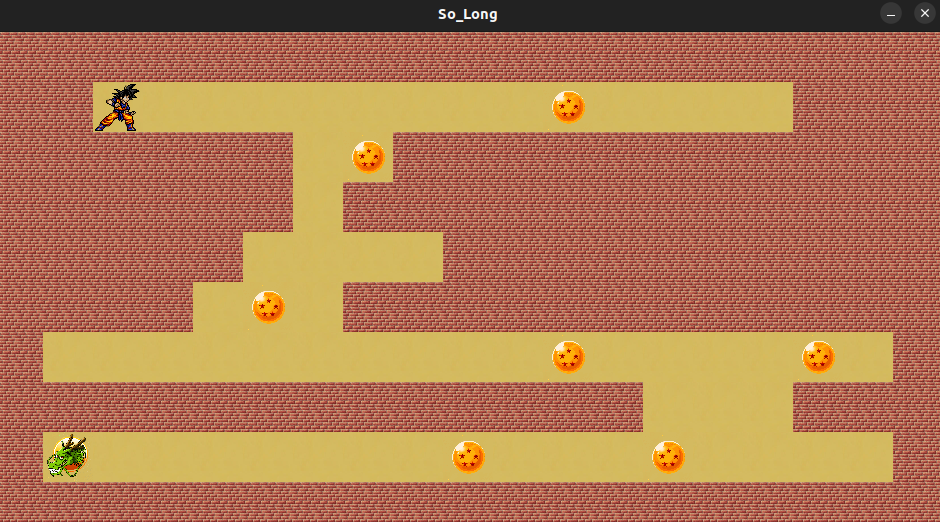

# so\_long



**so\_long** is a graphical project from the 42 school curriculum. Its goal is to teach the basics of 2D game development using a top-down view with the **MiniLibX** library.

## 🌍 Objective

Create a small game where the player moves a character around a map to collect all the items and reach the exit. The game uses the **MiniLibX** graphics library provided by 42.

## 📚 Skills Acquired

* File handling (reading `.ber` map files)
* Using the MiniLibX library (image loading, movement, rendering)
* Keyboard event handling
* Pathfinding algorithms (flood fill, BFS...)
* Memory management

## 📁 Project Structure

```bash
so_long
│ 
├── ft_printf/
│   ├── ft_printf.c
│   ├── ft_printf.h
│   ├── print_char.c
│   ├── print_hexa.c
│   ├── print_pointer.c
│   ├── print_str.c
│   └── print_unsigned.c
├── get_next_line/
│   ├── get_next_line.c
│   ├── get_next_line.h
│   └── get_next_line_utils.c
├── images/
│   ├── collectables.xpm
│   ├── exit.xpm
│   ├── floor.xpm
│   ├── player.xpm
│   └── walls.xpm
├── libs/
│   ├── game_controls.c
│   ├── game_display.c
│   ├── game_main.c
│   ├── map.c
│   ├── map_content.c
│   ├── so_long.h
│   ├── so_long_utilis.c
│   └── verif_file.c
├── maps/
│   ├── big_map.ber
│   ├── map_01.ber
│   ├── map_different_line_size.ber
│   ├── map_incorrect_body_walls.ber
│   ├── map_incorrect_walls_top_bottom.ber
│   ├── map_invalid_character.ber
│   ├── map_invalid_content.ber
│   ├── map_square.ber
│   └── small_map.ber
├── main.c
└── Makefile
└── mlx


```

## 🌐 Map

The maps are `.ber` files containing only the following characters:

| Symbol | Meaning           |
| ------ | ----------------- |
| `1`    | Wall              |
| `0`    | Floor             |
| `P`    | Player's position |
| `C`    | Collectible item  |
| `E`    | Exit              |

The map must:

* Be rectangular
* Be enclosed by walls
* Contain exactly one player, at least one `C`, and one `E`

## ⚡ Installation & Compilation

### Prerequisites

* macOS or Linux
* Make
* gcc
* MiniLibX library installed

### Compile the game

```bash
make
```

### Run the game

```bash
./so_long maps/big_map.ber
```

## 🚪 Controls

* Arrow keys or WASD to move the player
* Collect all `C` before going to the exit `E`

## 🚀 Bonus Features (if implemented)

* Enemy patrols
* Animated sprites
* Move counter
* Improved UI or sound effects


## 👤 Author

* [Mkadri66](https://github.com/Mkadri66)

---

> Project completed as part of the 42 School curriculum.


